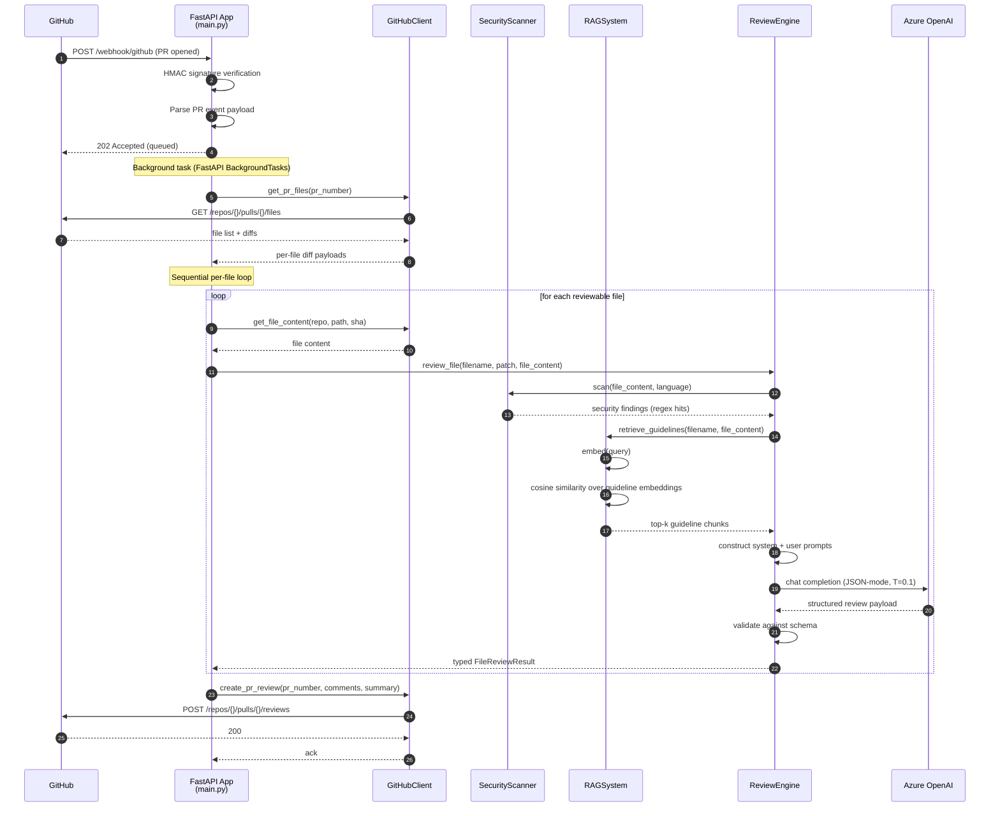

# Architecture

This document describes the system design of the Automated Code Review Agent: how the components are decomposed, how data flows between them, and where the deliberate boundaries between deterministic and stochastic computation are drawn. It is intended to be read after the README's *Approach* section and before reading the source.

## Design goals

The system is shaped by four design goals, in priority order:

1. **Auditability.** Every agent comment posted on a PR should be traceable back to a specific input — a diff hunk, a retrieved guideline, a static-scanner pattern hit. A reviewer should be able to answer "why did the agent say this?" without reading source code.
2. **Composable evaluation.** Each stage of the pipeline must be runnable in isolation so that ablations (RAG on/off, scanner on/off, model swaps) require no architectural change.
3. **Determinism where possible, stochasticity where necessary.** The LLM call is the only stochastic stage. Everything around it — signature verification, diff parsing, retrieval, prompt construction, schema validation, comment posting — is deterministic and testable with conventional unit tests.
4. **Operational realism.** The system is deployable as a single FastAPI service behind a webhook, runs in a container, and is wireable into a real GitHub installation. It is a research prototype, but it is not a notebook.

## Runtime data flow

## Component-by-component design

### 1. FastAPI orchestrator (`main.py`)

The orchestrator owns three responsibilities:

- HMAC verification of the inbound webhook against `GITHUB_WEBHOOK_SECRET`. Failures return `401` before any computation runs. (When the secret is unset, verification is bypassed for local development.)
- Parsing the PR event payload and rejecting events that are not `pull_request.opened` or `pull_request.synchronize`.
- Dispatching the actual review work as a FastAPI `BackgroundTasks` callable so the webhook returns `202 Accepted` quickly enough to keep GitHub's delivery retries from firing, then driving the per-file review loop.

The orchestrator does not own retrieval, inference, or comment posting directly — those are delegated to the components below. The boundary makes the orchestrator unit-testable without any LLM mocking.

### 2. `GitHubClient`

Wraps GitHub's REST endpoints behind an async `httpx`-based client. The client is the only module that talks to `github.com` outside the inbound webhook; this is enforced by passing the client into other components rather than letting them import it. Centralizing the network surface means rate-limiting, retries, and authentication can be configured in one place — and integration tests can swap in a recorded response replay.

The client exposes a small surface today:

- `get_pull_request(repo, pr_number)` — full PR metadata
- `get_pr_files(repo, pr_number)` — list of files changed and their diffs
- `get_file_content(repo, path, ref)` — raw file content at a given ref (base64-decoded from GitHub's contents endpoint)
- `create_pr_comment(repo, pr_number, body)` — issue-style PR comment (used for orchestration messages such as failure or no-files-to-review)
- `create_pr_review(repo, pr_number, commit_sha, comments, summary)` — structured review with line-level comments

### 3. `SecurityScanner`

A pattern-based static scanner backed by a documented catalog of regular expressions, each annotated with a vulnerability class and a human-readable explanation. The scanner is intentionally simple: it finds hits, returns structured findings, and does no semantic analysis.

Categories currently covered:

- Hardcoded secrets (passwords, API keys, tokens, AWS credentials)
- SQL injection (string-built queries with user-controlled inputs)
- Command injection (`eval`, `exec`, `os.system` with concatenation, `shell=True`)
- XSS sinks (`innerHTML` with concatenation, `dangerouslySetInnerHTML`, `document.write`)
- Path traversal

The scanner is a deliberate complement to, not a replacement for, the LLM. It runs first; its findings are passed into the LLM prompt as evidence. This serves three purposes:

- It catches a class of issues the LLM is unreliable on (regex-fast, exhaustively auditable).
- It gives the LLM concrete evidence to cite, which improves the LLM's grounding.
- It makes the system's security findings reproducible, since regex hits are deterministic.

Severity is assigned by class: SQL injection, command injection, and path traversal are `CRITICAL`; hardcoded secrets and XSS are `HIGH`; everything else is `MEDIUM`.

### 4. `RAGSystem`

The retrieval layer. The system loads every markdown file from `guidelines/`, embeds each as a single chunk via `text-embedding-ada-002`, and caches the embeddings in memory. At review time, the system embeds a query (file content + filename + detected language) and retrieves the top-*k* most similar guideline chunks by cosine similarity, with a 1.3× similarity boost for guidelines whose declared language matches the file's detected language. Embeddings are computed lazily on first retrieval if the cache is empty.

Two design notes:

- **Why guidelines, not codebase?** The current retrieval surface is the curated standards corpus. This is the simplest grounding signal that is both bounded (you can audit what is in it) and team-specific (the corpus is authored, not scraped). Extending retrieval to the surrounding codebase is a planned addition; see *Future Work* in the README.
- **Why cosine similarity, not a vector database?** The guideline corpus is small (tens to low hundreds of chunks). An in-memory NumPy similarity computation is faster, simpler, and easier to reason about than a vector database for this scale. If the corpus grows past the point where this becomes a performance issue, a swap to a managed vector store is a localized change.

A companion `GuidelineManager` class persists repository-specific guideline overrides to disk, so a deployment can layer a team's custom standards on top of the bundled defaults without modifying source.

### 5. `ReviewEngine` and the LLM boundary

The `ReviewEngine` is where the system's only stochastic stage lives. It composes the prompt, calls the LLM, validates the response, and returns a typed `FileReviewResult`.

The prompt is a system + user pair:

- **System message** establishes the role ("you are a code reviewer for a software team that follows the conventions documented below"), pins the output format to a JSON schema, and includes the retrieved guidelines (truncated per chunk for token efficiency) as authoritative context.
- **User message** carries the diff, the top 5 scanner findings sorted by severity (CRITICAL → HIGH → MEDIUM → LOW), and the file content. Both diff and file content are truncated to fixed character budgets to bound prompt size.

The LLM is invoked with:

- `response_format={"type": "json_object"}` — schema-shaped output is enforced at the API level, not begged for in prose.
- `temperature=0.1` — bias toward consistency over creativity. This is a deliberate trade-off; consistency under repeat is one of the metrics the [evaluation framework](./EVALUATION.md) regresses against.
- A pinned model deployment name. Evaluation runs are not portable across model versions, and the prompt is tuned against a specific model; pin the deployment in `.env` and update the pin only when re-running the full evaluation suite.

The response is parsed with `json.loads` and mapped onto `LineComment` and `SecurityIssue` dataclasses. Parse failures are caught and downgraded to a fall-through result with an empty comment list, so a malformed LLM response cannot crash the whole pipeline. Stronger schema validation (Pydantic models with explicit field constraints) is queued for the next refactor pass.

### 6. Evaluation harness (`code_review_agent/evaluation/`, in progress)

The evaluation package is independent from the runtime path. It loads PR fixtures from disk, drives the same `ReviewEngine` / `RAGSystem` / `SecurityScanner` components used in production, and computes metrics over the structured review output.

The harness is in active development; methodology and metric definitions are in [`EVALUATION.md`](./EVALUATION.md).

## Configuration boundaries

All external dependencies are configured via environment variables read at process start:

| Variable | Purpose |
|---|---|
| `AZURE_OPENAI_ENDPOINT` | Azure OpenAI resource endpoint |
| `AZURE_OPENAI_KEY` | API key |
| `AZURE_OPENAI_DEPLOYMENT` | Chat-model deployment name (pin for reproducibility) |
| `AZURE_EMBEDDING_DEPLOYMENT` | Embedding-model deployment name (pin for reproducibility) |
| `GITHUB_TOKEN` | GitHub PAT with `repo` and `write:discussion` scopes |
| `GITHUB_WEBHOOK_SECRET` | Shared secret for HMAC verification |

`.env.example` is checked in; `.env` is git-ignored.

## Concurrency model and current limits

The orchestrator returns `202` immediately and queues review work as a FastAPI `BackgroundTasks` callable. Per-PR concurrency is therefore handled by Uvicorn's worker model — multiple PRs delivered in quick succession will be processed in parallel by separate background tasks if the Uvicorn worker count permits.

Within a single PR, files are reviewed in a sequential loop. There are no explicit semaphores on outbound LLM or GitHub API calls today; if the agent is exposed to a high-volume repository, this is a load-bearing limitation that needs to be addressed before deployment. Adding bounded per-file concurrency with an explicit semaphore (and a graceful fallback when Azure OpenAI returns a 429) is on the roadmap.

`BackgroundTasks` is also not durable. If the FastAPI process restarts mid-review, in-flight reviews are lost. Promoting the queue to a real task system (Celery, dramatiq, or an Azure-native equivalent) is required for production deployment but is deliberately not in scope for the prototype.

## Failure modes and observability

The system distinguishes three classes of failure:

1. **Inbound failure.** Bad signature, malformed payload, unsupported event type. Return `400` or `401`, or an `ignored` JSON response. No background work is dispatched.
2. **Mid-pipeline failure.** GitHub API failure, embedding service failure, LLM failure, JSON-parse failure. Network failures propagate up; LLM JSON-parse failures are caught and downgraded to a fall-through `FileReviewResult`.
3. **Outer failure.** Any exception inside `process_pull_request` is caught and surfaced as an `issues` comment on the PR (`⚠️ Code review encountered an error: {message}`) so the PR author has visibility into the failure.

Structured logging with per-PR correlation IDs, retry policies for transient network failures, and a metrics surface for run-cost tracking are all queued for the observability pass — they are not yet implemented and should not be claimed as such.

## Deployment

The system is packaged as a Docker container and deployable to:

- **Azure Container Instances** for low-throughput, single-tenant deployments.
- **Azure App Service** for higher throughput, with the included `azure-pipelines.yml` driving the deploy.
- **Local + ngrok** for development, demonstrated in the README.

The deployment surface is intentionally narrow. Multi-tenant operation, regional failover, and high-availability deployment are out of scope for the prototype.

## Boundaries that are deliberately not crossed

- **No database.** The agent is stateless between PR events. All grounding context is loaded from disk at startup; review payloads are written to GitHub, not persisted locally. Adding a database is a future-work item, not an oversight.
- **No user-facing UI.** The only interface is GitHub PR comments. A dashboard for review history, run-cost tracking, or fixture management is deliberately excluded — the agent's surface should be the artifact engineers already look at.
- **No fine-tuning.** The grounding strategy is retrieval, not parameter updates. This is a research choice: retrieval is auditable (you can inspect the retrieved context for any review), fine-tuning is not.

These boundaries can be crossed in future iterations, but they are crossed deliberately, not accreted.
