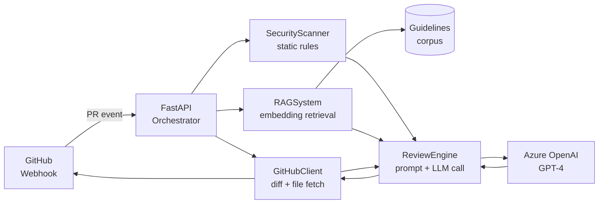

# Automated Code Review Agent

> A research prototype for grounded, agentic LLM-based code review on GitHub pull requests.

[](https://www.python.org/downloads/)
[](https://azure.microsoft.com/en-us/products/ai-services)
[](https://fastapi.tiangolo.com/)
[](./LICENSE)

This repository accompanies an applied study on whether retrieval-augmented, agentic LLM workflows can deliver code review that is consistent, auditable, and grounded enough to be trustworthy in real software-engineering practice. It is an in-progress prototype, not a polished tool.

For a faculty-facing summary of the research framing, see [`RESEARCH.md`](./RESEARCH.md).
For system design details, see [`ARCHITECTURE.md`](./ARCHITECTURE.md).
For evaluation methodology and metrics, see [`EVALUATION.md`](./EVALUATION.md).

---

## Problem

Manual code review remains the dominant quality gate in software engineering, and it is expensive, latent, and inconsistent. Reviewer attention is uneven across files; team-specific conventions are enforced unevenly across reviewers; junior contributors wait hours or days for feedback that could be available immediately.

LLM-based code review is the obvious response, but the obvious approach — hand a diff to a general-purpose model and ask for feedback — fails in two predictable ways. First, the model has no knowledge of team-specific engineering standards, so its feedback drifts toward generic best practices rather than the conventions a particular team has settled on. Second, when the model does not know, it is prone to confidently inventing rationales that sound right but do not correspond to the team's actual rules. Both failure modes degrade trust faster than the speedup buys back.

This project asks a narrower, more tractable question: **if a code review agent is grounded in a curated, team-specific standards corpus through retrieval-augmented generation, and structured to separate static-analysis evidence from LLM commentary, can the resulting review output be made consistent and faithful enough to be useful in practice?**

## Motivation

The system is designed around three working hypotheses, each drawn from current literature and each testable on real PR fixtures:

1. **Grounding through retrieval reduces hallucination on long-tail conventions.** Generic LLMs have wide but shallow knowledge of style and security guidelines. A RAG pipeline that retrieves over a curated, team-authored corpus should produce review feedback that cites and applies those specific guidelines rather than inventing plausible-sounding alternatives.
2. **Layered defense beats LLM-only review.** Pattern-based static analysis (regex over a documented catalog of vulnerability classes) and LLM-based reasoning have complementary failure modes. The static layer is high-precision, low-recall, and exhaustively auditable; the LLM layer is the opposite. Composing the two should improve aggregate review quality without compounding their weaknesses.
3. **Structured output makes reliability measurable.** Forcing the LLM into a typed JSON schema (severity, location, citation, suggestion) turns review quality from a subjective impression into a property that can be benchmarked, ablated, and regressed against.

These hypotheses motivate the architecture described below; the [evaluation framework](./EVALUATION.md) describes how each will be tested.

## Approach

The system is an event-driven service that listens for GitHub pull-request events, retrieves grounding context for each changed file, runs both a static security pass and a grounded LLM review pass, and posts structured comments back to the PR.

The pipeline is deliberately decomposed into stages so each can be measured and ablated independently:

```text
PR event  →  HMAC signature verification  →  diff fetch  →  per-file routing
                                                              │
                ┌─────────────────────────────────────────────┤
                ▼                                             ▼
         Static security pass                          RAG retrieval
         (regex catalog over                           (embedding-based
          documented patterns)                          similarity over
                                                        guidelines corpus)
                │                                             │
                └─────────────────────┬───────────────────────┘
                                      ▼
                              Prompt orchestration
                          (system role + retrieved
                           context + scanner findings
                           + diff + structured-output
                           contract)
                                      ▼
                                LLM inference
                                      ▼
                          JSON review payload
                                      ▼
                       Structured PR comments posted
```

A more detailed component description, including the runtime data flow and the boundary between deterministic and stochastic stages, is in [`ARCHITECTURE.md`](./ARCHITECTURE.md).

## Architecture



The four core modules under `code_review_agent/`:

| Module | Responsibility | Determinism |
|---|---|---|
| `main.py` | FastAPI app, HMAC webhook verification, event routing, background-task dispatch, per-PR orchestration | Deterministic |
| `github_client.py` | GitHub REST interactions: PR diff fetch, file content fetch, comment + review submission | Deterministic (modulo network) |
| `rag_system.py` | Guideline embedding (Azure `text-embedding-ada-002`), cosine-similarity retrieval, language-aware boosting, embedding cache, optional repo-specific guideline overrides via `GuidelineManager` | Deterministic given a fixed embedding model |
| `review_engine.py` | Prompt construction, LLM invocation, JSON-schema-enforced output, severity assignment; hosts `SecurityScanner` (regex catalog) for the static layer | Stochastic at the LLM call; deterministic everywhere else |

A planned refactor will split `review_engine.py` into separate orchestration / inference / static-scanner modules so each stage is independently testable. See *Future Work*.

## Evaluation

A claim of *applied study* obliges a real evaluation. The [`EVALUATION.md`](./EVALUATION.md) document defines the methodology this repo is being measured against; the [`code_review_agent/evaluation/`](./code_review_agent/evaluation/) package contains a runnable harness skeleton against which results can be reproduced.

The evaluation framework targets four questions:

- **Correctness.** On a held-out fixture set of PR diffs with known-good and known-bad patterns, what fraction of injected issues does the agent surface? What fraction of its findings are false positives?
- **Grounding fidelity.** When the agent cites a guideline, does the cited guideline actually apply to the code it is commenting on? This is measured on a hand-labeled subset.
- **RAG ablation.** How much of the agent's correctness depends on retrieval grounding? The harness runs each fixture twice — once with full retrieval, once with retrieval disabled — and compares.
- **Consistency under repeat.** Run each fixture *N* times. How often does the agent produce the same set of findings? Variance under repeat is a concrete proxy for the reliability claim made in the project's framing.

Numerical results are not yet committed; the harness is in place, and benchmark dataset construction is the active workstream. See [`EVALUATION.md`](./EVALUATION.md) for the experiment design and current status.

## Limitations

This is a research prototype, and the limitations matter as much as the design choices.

- **Retrieval surface is one corpus, not two.** The current RAG layer embeds and retrieves over the curated standards corpus in `guidelines/`. It does not retrieve over the surrounding repository — caller and callee files, related modules, recent commit history. Faculty-grade *code-context retrieval* in the strong sense is on the roadmap, not in `main`.
- **Static scanner is regex-based.** The `SecurityScanner` covers documented patterns (injection, hardcoded secrets, XSS, command injection, path traversal). It will not catch dataflow-dependent vulnerabilities. This is a deliberate trade-off — auditability over coverage — but it bounds what the system can claim about security review.
- **Per-file processing is sequential.** Within a single PR, files are reviewed in a serial loop. Concurrency is currently per-PR (FastAPI background tasks dispatching different PRs in parallel). Adding bounded per-file concurrency with explicit rate-limit awareness is a planned change.
- **No queue or back-pressure.** The system uses FastAPI's in-process `BackgroundTasks` for review work. It is not durable; restarts lose in-flight reviews. A real task queue (Celery, dramatiq, or similar) is required for serious deployment but is out of scope for the prototype.
- **Single LLM provider.** All experiments use Azure OpenAI. Cross-provider comparison (Anthropic, open-weight models) is a planned ablation but is not implemented.
- **No human evaluator study.** The evaluation harness measures programmatic properties (correctness on fixtures, grounding citations, repeat consistency). It does not yet measure perceived usefulness from a working engineer's perspective. Designing that study is part of the work.
- **Single-tenant.** No support for serving multiple repositories or organizations from one deployment. This is fine for a prototype but bounds claims about scale.
- **Benchmark dataset is small and in-progress.** The fixture set is being built by hand and is not yet large enough to support strong empirical claims. Result tables are placeholders until the dataset is at a defensible size.
- **Known correctness issue.** When the agent posts inline review comments, the `position` field passed to GitHub's review API is currently the source-file line number rather than the diff position the API expects; in some cases this causes comments to render against the wrong line or be rejected. Tracked as a Phase-1 fix; see [`EVALUATION.md`](./EVALUATION.md) for how this affects fixture-based evaluation today.
- **Guideline category metadata is best-effort.** The retriever assigns each guideline a category (`security`, `style`, `performance`, `best-practice`) by inspecting either the parent folder name or the filename. With the current default layout — guideline files directly under `guidelines/` — categories are inferred from filename substrings rather than folder structure. This is good enough for the language-aware retrieval boost in the current pipeline, but a planned change is to organize `guidelines/` into category subfolders so the metadata is structural, not heuristic.
- **`GuidelineManager` is implemented but not wired into the default RAG pipeline.** The class persists repository-specific guideline overrides to disk, but the runtime path in `main.py` does not currently load repo overrides on top of the bundled defaults. It exists as a forward-compatible hook for the multi-tenant case; integrating it into `RAGSystem.initialize` is a small follow-up.
- **`PRComment` dataclass is part of the public package API but unused at runtime.** `code_review_agent.github_client.PRComment` is exported for callers and tests; the production `process_pull_request` path in `main.py` constructs comment dicts directly against GitHub's review-API shape. This is a tidy-up item rather than a correctness issue — the dataclass and the dict shape don't disagree, the runtime path just hasn't been migrated to use the typed object.
- **Evaluation harness gaps.** Three things to call out so they don't surprise readers who run the harness:
  - **Grounding-fidelity scoring requires human-graded inputs.** The harness emits `GroundingTask` objects per (comment, retrieved-guideline) pair; a separate aggregator (`aggregate_grounding_labels`) computes citation-applicability and citation-specificity scores once a human has filled in the `applicable` and `specific` labels. Until that labeled batch exists, the harness produces tasks but not scores.
  - **Citation extraction is not yet structural.** The current prompt does not require the LLM to emit explicit cited-guideline IDs in its JSON output. Until it does, `cited_guideline_ids` on each task is empty; raters compare the comment text against the *retrieved* guidelines to make the applicability call. Tightening the prompt is a small next step.
  - **Negative-assertion fixtures support both file-scoped and line-scoped intent.** Line-scoped assertions matter in mixed-fixture cases (a vulnerable example and a fixed example in the same file); without line scoping, a category-only negative assertion would be violated by every same-category finding in the file. The schema supports both today; older fixture files written before the schema change need to be updated to use `line` + `line_tolerance` where intent was line-scoped.

## Future Work

Ordered by research interest, not by engineering effort:

- **Code-context retrieval over the repository.** A second retrieval surface that, given a changed file, fetches the most relevant other files (callers, callees, recently co-changed files) and includes them in the LLM prompt. Closes the strongest gap between current capability and the prototype's framing.
- **Reliability under sustained operation.** Track whether review quality degrades under load, prompt drift, or model-version churn. This connects the project to the *systems-reliability-for-LLMs* research direction.
- **Citation faithfulness as a first-class metric.** Beyond "did the agent cite *some* guideline," measure whether the citation actually applies and whether the suggested fix is consistent with the guideline's intent.
- **Lightweight agentic decomposition.** Replace the single-LLM-call review with a small directed agent: planner that selects which files to look at, retriever that fetches context, reviewer that generates the comment, verifier that checks the comment against the cited guideline. Each stage observable; each ablation possible.
- **Cross-provider robustness.** Run the same fixture set across multiple LLM providers and measure variance.

---

## Reproducibility

### Prerequisites

- Python 3.10+
- An Azure OpenAI resource with a deployed GPT-4 chat model and a deployed `text-embedding-ada-002` embedding model
- A GitHub account with admin access to the repository the agent will review
- Docker (only required for containerized deployment)

### Local setup

```bash
git clone https://github.com/munisht06/automated-code-review-agent.git
cd automated-code-review-agent

python -m venv venv
source venv/bin/activate          # On Windows: venv\Scripts\activate
pip install -e ".[dev]"

cp .env.example .env               # then fill in credentials
```

### Required environment

```env
# Azure OpenAI
AZURE_OPENAI_ENDPOINT=https://your-resource.openai.azure.com/
AZURE_OPENAI_KEY=your-api-key
AZURE_OPENAI_DEPLOYMENT=gpt-4
AZURE_EMBEDDING_DEPLOYMENT=text-embedding-ada-002

# GitHub
GITHUB_TOKEN=ghp_your-token            # scopes: repo, write:discussion
GITHUB_WEBHOOK_SECRET=your-webhook-secret
```

Pin the model and embedding deployment names you ran experiments against; evaluation results are not portable across model versions. See `.env.example` for guidance.

### Running

```bash
uvicorn code_review_agent.main:app --reload --port 8000
curl http://localhost:8000/health
```

For local webhook testing, expose port 8000 via `ngrok http 8000` and configure the resulting URL as the GitHub webhook target with content type `application/json`, the secret matching `GITHUB_WEBHOOK_SECRET`, and *Pull requests* as the subscribed event.

### Tests

```bash
pytest tests/ -v
pytest tests/ --cov=code_review_agent --cov-report=html
```

### Evaluation harness

```bash
# Run the evaluation harness against bundled fixtures
python -m code_review_agent.evaluation.runner --fixtures tests/fixtures/prs --report reports/
```

See [`EVALUATION.md`](./EVALUATION.md) for fixture authoring conventions and metric definitions. The runner currently supports correctness and consistency metrics on hand-labeled fixtures; grounding-fidelity scoring is being added.

---

## Project layout

```
automated-code-review-agent/
├── code_review_agent/             # Main package
│   ├── __init__.py
│   ├── main.py                    # FastAPI app + webhook handler
│   ├── github_client.py           # GitHub API client
│   ├── review_engine.py           # LLM review + SecurityScanner
│   ├── rag_system.py              # Embedding retrieval over guidelines
│   └── evaluation/                # Evaluation harness (in progress)
│       ├── __init__.py
│       ├── runner.py              # End-to-end harness driver
│       ├── metrics.py             # Correctness, grounding, consistency metrics
│       └── fixtures.py            # Fixture loading + schema
├── guidelines/                    # Curated standards corpus (markdown)
├── tests/
│   ├── test_review_engine.py      # Unit tests
│   └── fixtures/prs/              # Evaluation fixtures (in progress)
├── ARCHITECTURE.md                # System design notes
├── RESEARCH.md                    # Faculty-facing research brief
├── EVALUATION.md                  # Evaluation methodology
├── azure-pipelines.yml            # CI/CD pipeline
├── Dockerfile                     # Container image
├── pyproject.toml                 # Package metadata + dependencies
├── .env.example                   # Environment variable template
├── LICENSE                        # MIT
├── CITATION.cff                   # Citation metadata
└── README.md                      # This file
```

## Development

```bash
black code_review_agent/           # Format
ruff check code_review_agent/      # Lint
mypy code_review_agent/            # Type check
pytest tests/                      # Test
```

The included `azure-pipelines.yml` runs lint, test, security scan (Bandit, Safety), build, and deploy stages.

## Deployment

The project ships with a Dockerfile and Azure Pipelines configuration suitable for deployment to Azure Container Instances or Azure App Service. Deployment configuration examples are in [`ARCHITECTURE.md`](./ARCHITECTURE.md).

## License

MIT — see [`LICENSE`](./LICENSE).

## Author

Munish Tanwar — [mtanwar.com](https://mtanwar.com)

## Citing or referencing this work

If this prototype or its evaluation framework informs your own work, please cite the repository. A `CITATION.cff` is provided.

```
Tanwar, M. (2025). Automated Code Review Agent: a grounded, agentic LLM workflow
for pull-request review. https://github.com/munisht06/automated-code-review-agent
```
