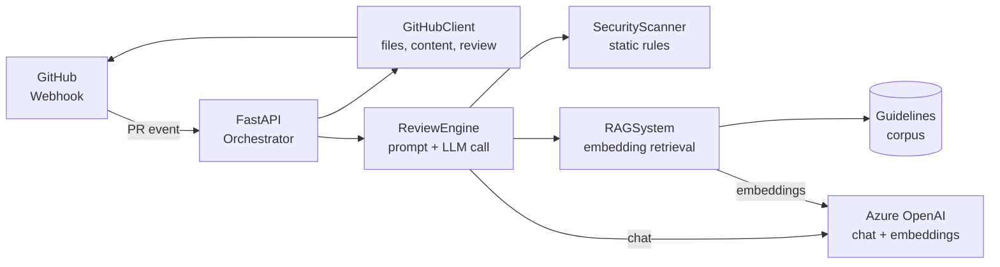

# Automated Code Review Agent

> A research prototype for retrieval-grounded LLM code review on GitHub pull requests.

[](https://www.python.org/downloads/)
[](https://azure.microsoft.com/en-us/products/ai-services)
[](https://fastapi.tiangolo.com/)
[](./LICENSE)

This repository holds an in-progress prototype and a written evaluation design for asking whether retrieval-augmented LLM workflows can deliver code review that is consistent, auditable, and grounded enough to be trustworthy in software-engineering practice. It is a research prototype, not a polished tool, and it reports no benchmark results yet. The evaluation design is still being revised; every change is logged in [`EVALUATION.md`](./EVALUATION.md).

For the research framing and open questions, see [`RESEARCH.md`](./RESEARCH.md).
For system design details, see [`ARCHITECTURE.md`](./ARCHITECTURE.md).
For evaluation methodology and metrics, see [`EVALUATION.md`](./EVALUATION.md).

---

## Problem

Manual code review is a standard quality gate in software engineering, and it is slow and uneven. Reviewer attention is uneven across files; team-specific conventions are enforced unevenly across reviewers; junior contributors wait hours or days for feedback that could be available immediately.

LLM-based code review is the obvious response, but the obvious approach — hand a diff to a general-purpose model and ask for feedback — fails in two predictable ways. First, the model has no knowledge of team-specific engineering standards, so its feedback drifts toward generic best practices rather than the conventions a particular team has settled on. Second, when the model does not know, it is prone to confidently inventing rationales that sound right but do not correspond to the team's actual rules.

This project asks a narrower, more tractable question: **if a code review agent is grounded in a curated, team-specific standards corpus through retrieval-augmented generation, and structured to separate static-analysis evidence from LLM commentary, can the resulting review output be made consistent and faithful enough to be useful in practice?**

## Motivation

The system is designed around three working hypotheses, each testable on labeled PR fixtures:

1. **Grounding through retrieval reduces hallucination on long-tail conventions.** Generic LLMs have wide but shallow knowledge of style and security guidelines. A RAG pipeline that retrieves over a curated, team-authored corpus should produce review feedback that cites and applies those specific guidelines rather than inventing plausible-sounding alternatives.
2. **Layered defense beats LLM-only review.** Pattern-based static analysis (regex over a documented catalog of vulnerability classes) and LLM-based reasoning have complementary failure modes. The static layer is meant to be high-precision and low-recall (its precision has not yet been measured) and is exhaustively auditable; the LLM layer covers more but is less predictable, and its precision and recall are also unmeasured. Composing the two should improve aggregate review quality without compounding their weaknesses.
3. **Structured output makes reliability measurable.** Asking the LLM for a fixed JSON structure (line, severity, category, issue, suggestion, and the IDs of the guidelines it applied) turns review quality from a subjective impression into a property that can be benchmarked, ablated, and regressed against.

These hypotheses motivate the architecture described below; the [evaluation framework](./EVALUATION.md) describes how each will be tested.

## Approach

The system is an event-driven service that listens for GitHub pull-request events, retrieves grounding context for each changed file, runs both a static security pass and a grounded LLM review pass, and posts structured comments back to the PR.

The pipeline is deliberately decomposed into stages so each can be measured and ablated independently:

```text
PR event  →  HMAC signature verification  →  diff fetch  →  per-file routing
                                                              │
                ┌─────────────────────────────────────────────┤
                ▼                                             ▼
         Static security pass                          RAG retrieval
         (regex catalog over                           (embedding-based
          documented patterns)                          similarity over
                                                        guidelines corpus)
                │                                             │
                └─────────────────────┬───────────────────────┘
                                      ▼
                              Prompt orchestration
                          (system role + retrieved
                           context + scanner findings
                           + diff + structured-output
                           contract)
                                      ▼
                                LLM inference
                                      ▼
                          JSON review payload
                                      ▼
                       Structured PR comments posted
```

A more detailed component description, including the runtime data flow and the boundary between deterministic and stochastic stages, is in [`ARCHITECTURE.md`](./ARCHITECTURE.md).

## Architecture


```mermaid
flowchart LR
    GH[GitHub<br/>Webhook] -->|PR event| FA[FastAPI<br/>Orchestrator]
    FA --> GC[GitHubClient<br/>files, content, review]
    FA --> RE[ReviewEngine<br/>prompt + LLM call]
    RE --> SS[SecurityScanner<br/>static rules]
    RE --> RAG[RAGSystem<br/>embedding retrieval]
    RAG --> GLI[(Guidelines<br/>corpus)]
    RE -->|chat| AOAI[Azure OpenAI<br/>chat + embeddings]
    RAG -->|embeddings| AOAI
    GC --> GH
```

The four core modules under `code_review_agent/`:

| Module | Responsibility | Determinism |
|---|---|---|
| `main.py` | FastAPI app, HMAC webhook verification, event routing, background-task dispatch, per-PR orchestration, mapping comments onto diff lines | Deterministic |
| `github_client.py` | GitHub REST interactions: paginated file list, file content fetch, comment + review submission; `commentable_lines` for diff-line mapping | Deterministic (modulo network) |
| `rag_system.py` | Guideline embedding (Azure `text-embedding-ada-002`), cosine-similarity retrieval with a language-match boost, in-memory embedding cache. `GuidelineManager` (repo-specific overrides) exists but is not wired in | Deterministic given a fixed embedding model |
| `review_engine.py` | Prompt construction with visible truncation, one LLM call in JSON mode (syntactically valid JSON unless the response is cut off at the token limit; the field structure is requested in the prompt and checked when parsing), parsing with recorded failures; hosts `SecurityScanner` (regex catalog) for the static layer | Stochastic at the LLM call; deterministic everywhere else |

A planned refactor would move `SecurityScanner` out of `review_engine.py` into its own module.

## Evaluation

[`EVALUATION.md`](./EVALUATION.md) defines the methodology, and [`code_review_agent/evaluation/`](./code_review_agent/evaluation/) contains a runnable harness, including an offline mode that needs no credentials.

The evaluation framework targets four questions:

- **Correctness.** On labeled PR fixtures with known-good and known-bad patterns (currently one fixture), what fraction of injected issues does the agent surface? What fraction of its findings are false positives?
- **Grounding fidelity.** When the agent cites a guideline, does the cited guideline actually apply to the code it is commenting on? Structural checks run automatically (was the required guideline retrieved, and did the matching comment cite it); applicability is judged on a hand-labeled subset.
- **RAG ablation.** How much of the agent's correctness depends on retrieval grounding? Each configuration is one harness run (`--no-rag` for the RAG-off arm) and the two reports are compared. With the bundled two-document corpus, retrieval returns every guideline, so today this compares all guidelines against none; [`EVALUATION.md`](./EVALUATION.md) lists this and the other known confounds.
- **Consistency under repeat.** Run each fixture *N* times. How often does the agent produce the same set of findings? This is to be measured first: until run-to-run spread is known, a difference between configurations cannot be separated from noise.

Numerical results are not yet committed; the harness is in place, and benchmark dataset construction is the active workstream. See [`EVALUATION.md`](./EVALUATION.md) for the experiment design and current status.

## Limitations

This is a research prototype, and the limitations matter as much as the design choices.

- **Retrieval surface is one corpus, not two.** The current RAG layer embeds and retrieves over the curated standards corpus in `guidelines/`. It does not retrieve over the surrounding repository — caller and callee files, related modules, recent commit history. *Code-context retrieval* in the strong sense is on the roadmap, not in `main`.
- **The bundled corpus is small and generic.** Two public best-practice documents stand in for a team-specific corpus, each embedded as one chunk. With `top_k=3`, every guideline is retrieved for every file, so retrieval orders the guidelines but never excludes one, and grounding cannot yet be separated from what the model already knows. Section-level chunks and team-specific conventions the model cannot know are the next steps.
- **Prompt budgets.** Each retrieved guideline (4,000 characters), the diff (2,000) and the file content (4,000) are capped before they enter the prompt. A cut is made at a line break, marked in the prompt and recorded in the evaluation report. An earlier 500-character guideline cap silently removed the security section of both guidelines, so the SQL-injection fixture never saw the guidance it is meant to cite; that is why prompt cuts are no longer silent. Two cuts remain unmarked because the model never sees their input: the retrieval query uses the first 1,000 characters of the file, and embedding inputs are capped at 8,000. Both bundled guidelines are under 2,700 characters.
- **Static scanner is regex-based.** The `SecurityScanner` covers documented patterns (injection, hardcoded secrets, XSS, command injection, path traversal). It will not catch dataflow-dependent vulnerabilities, and its precision has not been measured. This is a deliberate trade-off (auditability over coverage), but it bounds what the system can claim about security review.
- **Per-file processing is sequential.** Within a single PR, files are reviewed in a serial loop. Concurrency is currently per-PR (FastAPI background tasks dispatching different PRs in parallel). Adding bounded per-file concurrency with explicit rate-limit awareness is a planned change.
- **No queue or back-pressure.** The system uses FastAPI's in-process `BackgroundTasks` for review work. It is not durable; restarts lose in-flight reviews. A real task queue (Celery, dramatiq, or similar) is required for serious deployment but is out of scope for the prototype.
- **Single LLM provider.** The code supports only Azure OpenAI. Cross-provider comparison (Anthropic, open-weight models) is a planned ablation but is not implemented.
- **No human evaluator study.** The evaluation harness measures programmatic properties (correctness on fixtures, grounding citations, repeat consistency). It does not yet measure perceived usefulness from a working engineer's perspective. Designing that study is part of the work.
- **Single-tenant.** No support for serving multiple repositories or organizations from one deployment. This is fine for a prototype but bounds claims about scale.
- **Benchmark dataset is small and in-progress.** The fixture set is being built by hand and is not yet large enough to support strong empirical claims. No result tables are published until the dataset is at a defensible size.
- **Inline comments are limited to lines in the diff.** Comments are posted with GitHub's `line` and `side` fields, and only for lines that appear in the diff; comments on other lines go into the review summary, since GitHub rejects a whole review if one comment falls outside the diff. The diff-line mapping and the routing in `process_pull_request` are unit-tested with stubbed GitHub and engine objects; posting has not been exercised against the live API in this repository's tests.
- **Prompt injection.** Pull-request content is untrusted input placed in the prompt, and the model's output is posted back to the pull request. There is no defense beyond parsing the output as JSON.
- **Guideline metadata is inferred from file names.** Language comes from the file-name prefix (`python_…`, `typescript_…`) and category from the folder or file name. Both bundled files resolve to `best-practice`, and no stage reads the category yet.
- **`GuidelineManager` is implemented but not wired into the default RAG pipeline.** The class persists repository-specific guideline overrides to disk, but the runtime path in `main.py` does not currently load repo overrides on top of the bundled defaults. It exists as a forward-compatible hook for the multi-tenant case; integrating it into `RAGSystem.initialize` is a small follow-up.
- **Grounding fidelity needs human labels.** The harness emits one labeling task per comment, carrying the guideline IDs the comment cites and the IDs retrieved for its file; `aggregate_grounding_labels` scores applicability and specificity once a grader fills in the labels. No labeled batch exists yet.
- **Citations are self-reported.** The prompt asks the model to list the IDs of the guidelines each comment applies. Whether a cited guideline actually applies is what the labeling measures.

## Future Work

Ordered by research interest, not by engineering effort:

- **Code-context retrieval over the repository.** A second retrieval surface that, given a changed file, fetches the most relevant other files (callers, callees, recently co-changed files) and includes them in the LLM prompt. Closes the strongest gap between current capability and the prototype's framing.
- **Reliability under sustained operation.** Track whether review quality degrades under load, prompt drift, or model-version churn.
- **Separating ranking failures from grounding failures.** Section-level retrieval over a larger corpus that mixes prose, configuration and structured records, with `top_k` below the corpus size, so a degraded review can be traced to a guideline that was never retrieved or to one that was retrieved and not applied.
- **Citation faithfulness beyond structure.** Beyond whether a comment cites the required guideline, measure whether the citation actually applies and whether the suggested fix is consistent with the guideline's intent.
- **Lightweight agentic decomposition.** Replace the single-LLM-call review with a small directed agent: planner that selects which files to look at, retriever that fetches context, reviewer that generates the comment, verifier that checks the comment against the cited guideline. Each stage observable; each ablation possible.
- **Cross-provider robustness.** Run the same fixture set across multiple LLM providers and measure variance.

---

## Reproducibility

### Prerequisites

- Python 3.10+
- For live runs only: an Azure OpenAI resource with a deployed chat model that supports JSON mode and a deployed `text-embedding-ada-002` embedding model (tests and the offline harness need no credentials)
- A GitHub account with admin access to the repository the agent will review
- Docker (only required for containerized deployment)

### Local setup

```bash
git clone https://github.com/munisht06/automated-code-review-agent.git
cd automated-code-review-agent

python -m venv venv
source venv/bin/activate          # On Windows: venv\Scripts\activate
pip install -e ".[dev]"

cp .env.example .env               # then fill in credentials
```

### Required environment

```env
# Azure OpenAI
AZURE_OPENAI_ENDPOINT=https://your-resource.openai.azure.com/
AZURE_OPENAI_KEY=your-api-key
AZURE_OPENAI_DEPLOYMENT=gpt-4
AZURE_EMBEDDING_DEPLOYMENT=text-embedding-ada-002

# GitHub
GITHUB_TOKEN=ghp_your-token            # classic token scope: repo
GITHUB_WEBHOOK_SECRET=your-webhook-secret
# Local development only: accept unsigned webhooks when no secret is set
# ALLOW_UNSIGNED_WEBHOOKS=1
```

Pin the model and embedding deployment names you ran experiments against; evaluation results are not portable across model versions. See `.env.example` for guidance.

### Running

```bash
uvicorn code_review_agent.main:app --reload --port 8000
curl http://localhost:8000/health
```

For local webhook testing, expose port 8000 via `ngrok http 8000` and configure the resulting URL as the GitHub webhook target with content type `application/json`, the secret matching `GITHUB_WEBHOOK_SECRET`, and *Pull requests* as the subscribed event.

### Tests

```bash
pytest tests/ -v                 # runs offline; no credentials needed
pytest tests/ --cov=code_review_agent --cov-report=html
```

### Evaluation harness

```bash
# Offline, no credentials: checks the harness end to end with a
# scanner-echo stand-in for the LLM. Not a model result.
python -m code_review_agent.evaluation.runner --fixtures tests/fixtures/prs --mock-llm --report reports/mock/

# Live, with Azure OpenAI settings in the environment or .env
python -m code_review_agent.evaluation.runner --fixtures tests/fixtures/prs --report reports/
```

See [`EVALUATION.md`](./EVALUATION.md) for fixture authoring conventions, metric definitions, and the other runner options (`--no-rag`, `--repeats`, `--line-tolerance`).

---

## Project layout

```
automated-code-review-agent/
├── code_review_agent/             # Main package
│   ├── __init__.py
│   ├── main.py                    # FastAPI app + webhook handler
│   ├── github_client.py           # GitHub API client
│   ├── review_engine.py           # LLM review + SecurityScanner
│   ├── rag_system.py              # Embedding retrieval over guidelines
│   └── evaluation/                # Evaluation harness (in progress)
│       ├── __init__.py
│       ├── runner.py              # End-to-end harness driver
│       ├── metrics.py             # Correctness, consistency, citation, grounding
│       ├── fixtures.py            # Fixture loading + schema
│       └── mock_llm.py            # Offline stand-in for the LLM (--mock-llm)
├── guidelines/                    # Curated standards corpus (markdown)
├── tests/
│   ├── test_review_engine.py      # Scanner, parsing, prompt, webhook tests
│   ├── test_pipeline.py           # Corpus, truncation, parsing, diff mapping, webhook
│   ├── test_evaluation.py         # Metrics and an offline harness run
│   └── fixtures/prs/              # Evaluation fixtures (in progress)
├── ARCHITECTURE.md                # System design notes
├── RESEARCH.md                    # Research framing and open questions
├── EVALUATION.md                  # Evaluation methodology
├── azure-pipelines.yml            # CI/CD pipeline template (not connected)
├── Dockerfile                     # Container image
├── pyproject.toml                 # Package metadata + dependencies
├── .env.example                   # Environment variable template
├── LICENSE                        # MIT
└── README.md                      # This file
```

## Development

```bash
black code_review_agent/ tests/        # Format
ruff check code_review_agent/ tests/   # Lint
mypy code_review_agent/                # Type check
pytest tests/                          # Test (offline, no credentials)
```

`azure-pipelines.yml` is a pipeline template with lint, test, security-scan, build and deploy stages. It is not connected to a live project: its service connections are placeholders, its trigger paths do not match the package directory, and it has not been run.

## Deployment

The Dockerfile builds a container for the service, suitable for Azure Container Instances or Azure App Service. It has not been deployed to either.

## License

MIT — see [`LICENSE`](./LICENSE).

## Author

Munish Tanwar — [mtanwar.com](https://mtanwar.com)
